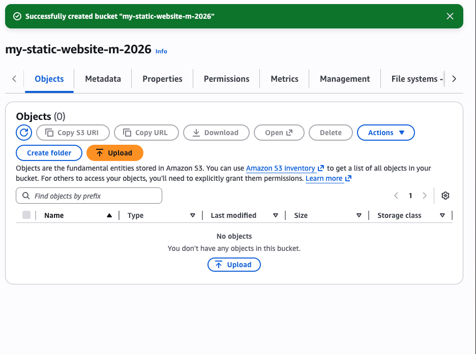
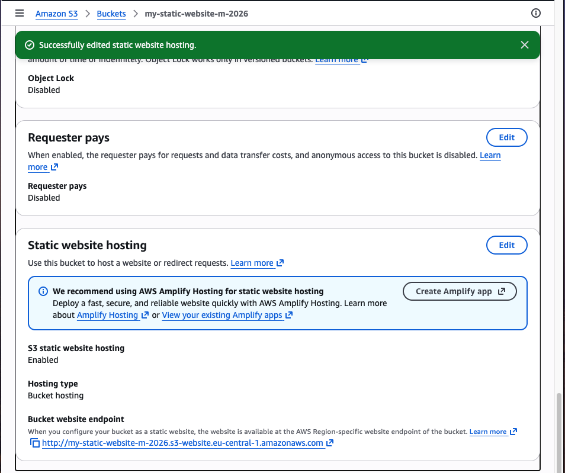
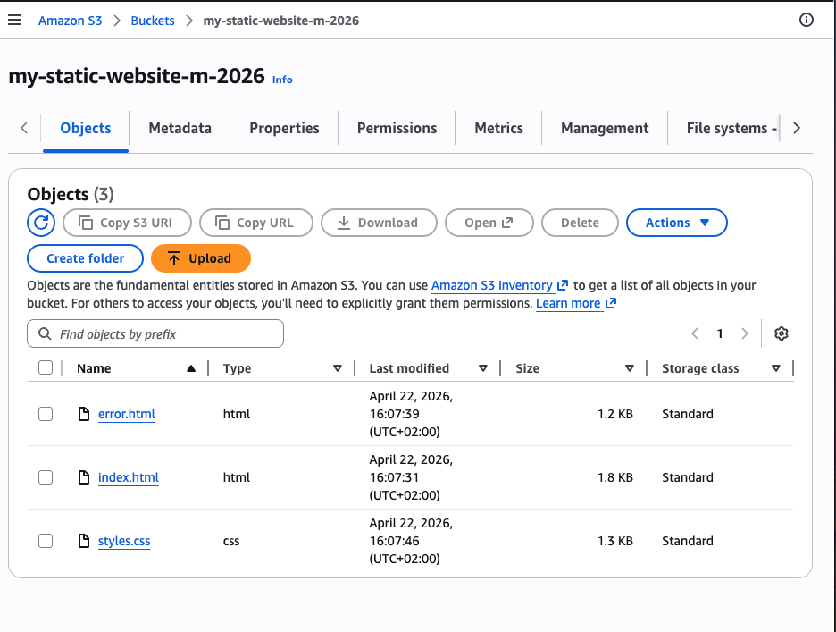
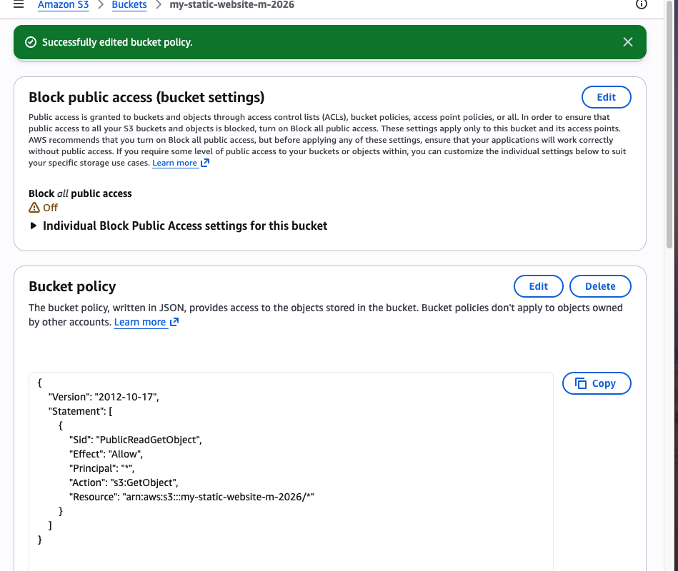
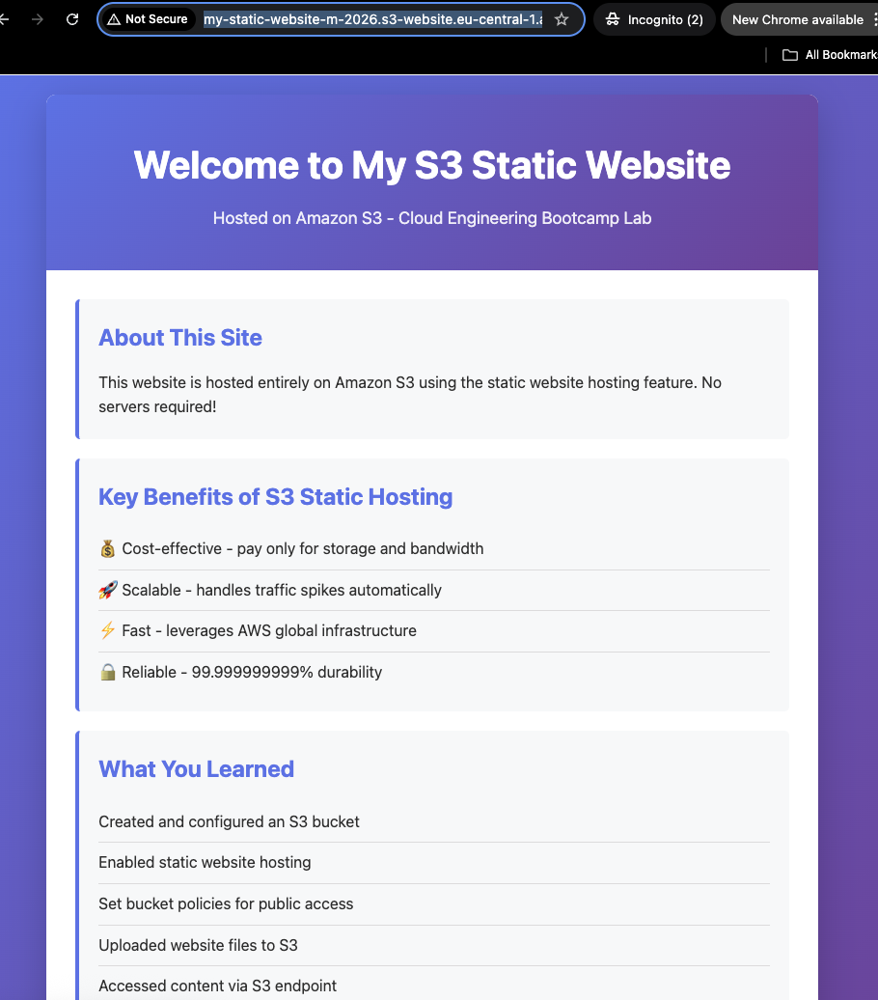
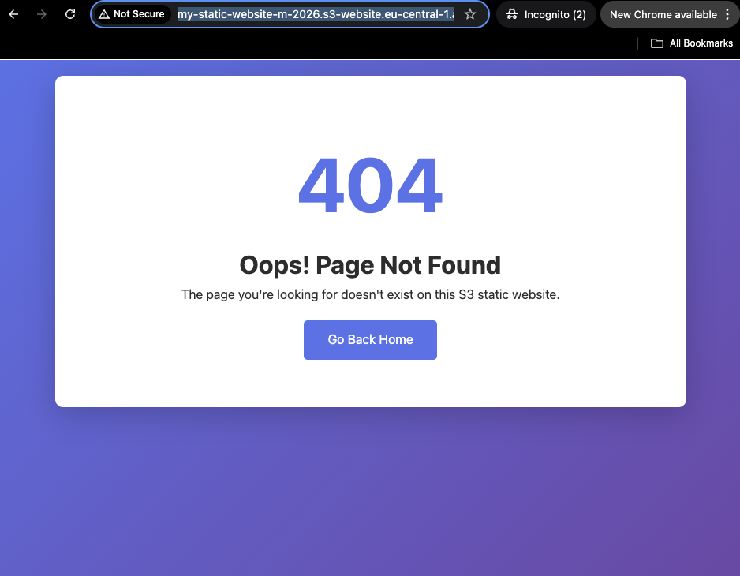

# Lab Solution: Host a Static Website on Amazon S3

**Student Name:** Mos  
**Date:** 22.04.2026  
**Lab Completion Time:** 40 minutes

---

## Part 1: Bucket Configuration

### Bucket Information

**Bucket Name:** my-static-website-m-2026

**Region:** eu-central-1

**Bucket Website Endpoint URL:**
```
http://my-static-website-m-2026.s3-website.eu-central-1.amazonaws.com
```

**Screenshot 1: Bucket Creation Confirmation**


---

## Part 2: Static Website Hosting Configuration

### Configuration Details

**Index Document:** index.html

**Error Document:** error.html

**Screenshot 2: Static Website Hosting Settings**


---

## Part 3: Website Files

### Files Created

List the files you created:
1. index.html
2. styles.css
3. error.html

**Did you customize the HTML/CSS?** (Yes/No): No

**If yes, describe your customizations:**
```
_____________________________________________________________
_____________________________________________________________
_____________________________________________________________
```

**Screenshot 3: Files Uploaded to S3**


---

## Part 4: Bucket Policy

### Bucket Policy Applied

**Paste your complete bucket policy here:**
```json
{
    "Version": "2012-10-17",
    "Statement": [
        {
            "Sid": "PublicReadGetObject",
            "Effect": "Allow",
            "Principal": "*",
            "Action": "s3:GetObject",
            "Resource": "arn:aws:s3:::my-static-website-m-2026/*"
        }
    ]
}
```

**Screenshot 4: Bucket Policy Configuration**


---

## Part 5: Testing and Verification

### Website Testing

**Website URL (from endpoint):**
```
http://my-static-website-m-2026.s3-website.eu-central-1.amazonaws.com/
```

**Did the website load successfully?** (Yes/No): Yes

**Did the CSS styling apply correctly?** (Yes/No): Yes

**Screenshot 5: Working Website**


### Error Page Testing

**Test URL used:**
```
http://my-static-website-m-2026.s3-website.eu-central-1.amazonaws.com/bla
```

**Did custom error page display?** (Yes/No): Yes

**Screenshot 6: Custom 404 Error Page**


---

## Part 6: CLI Commands Used

**Document all AWS CLI commands you executed:**

Used the console.

```bash
# Bucket creation


# Enable website hosting


# Upload files


# Apply bucket policy


# Verify configuration


```

---

## Bonus Challenges Completed

- [ ] Challenge 1: Added about.html page
- [ ] Challenge 2: Used subdirectories for organization
- [ ] Challenge 3: Used `aws s3 sync` command

**Bonus Challenge Notes:**
```
_____________________________________________________________
_____________________________________________________________
_____________________________________________________________
```

---

## Reflection Questions

### 1. What are the advantages of S3 static hosting compared to traditional web servers?

**Your answer:**
```
S3 static hosting is simpler because there are no web servers. For static files like HTML, CSS,
JavaScript, it is cheaper and faster to set up than running a VM.
```

### 2. Why is a bucket policy necessary for public website access?

**Your answer:**
```
S3 buckets are private by default, anonymous visitors cannot read the website files
unless access is explicitly allowed
```

### 3. What are the limitations of S3 static website hosting?

**Your answer:**
```
It cannot run server side code, process forms, connect directly to a database, for example it can't run a full stack servers like django.
```

### 4. When would you NOT use S3 for website hosting?

**Your answer:**
```
I would not use S3 by itself for an application that needs backend processing, user
authentication handled on the server.

In those cases I would use a backend service such as EC2, Elastic Beanstalk.
```

### 5. How does S3 static hosting fit into cost optimization strategies?

**Your answer:**
```
Costs are mainly based on storage, requests, and data transfer, so a small static site
can be very inexpensive. 

It is a good fit for landing pages, documentation, portfolios,
and other static sites where paying for a full server would be unnecessary.
```

---

## Troubleshooting Log

**Did you encounter any issues?** (Yes/No): No

**If yes, document the issues and how you resolved them:**

| Issue | Error Message | Solution | Time to Resolve |
|-------|--------------|----------|-----------------|
|       |              |          |                 |
|       |              |          |                 |
|       |              |          |                 |

---

## Cleanup Confirmation

- [X] Emptied S3 bucket
- [X] Deleted S3 bucket
- [X] Verified no resources remain

**Cleanup CLI commands used:**
```bash
# Empty bucket
aws s3 rm s3://my-static-website-m-2026/ --recursive

# Delete bucket
aws s3 rb s3://my-static-website-m-2026/

```

---

## Self-Assessment

**Rate your understanding of each concept (1-5, where 5 is expert):**

| Concept | Rating | Notes |
|---------|--------|-------|
| S3 bucket creation | 5/5 | |
| Static website hosting configuration | 5/5 | |
| Bucket policies and public access | 4/5 | |
| Uploading and managing S3 objects | 5/5 | |
| S3 website endpoints | 4/5 | |
| HTML/CSS basics | 5/5 | |

---

## Instructor Verification

**Instructor Name:** ___________________________

**Date Reviewed:** ___________________________

**Website URL Verified:** ☐ Yes ☐ No

**Comments:**
```
_____________________________________________________________
_____________________________________________________________
_____________________________________________________________
```

**Grade/Status:** ___________________________

---

## Additional Resources Referenced

List any documentation, tutorials, or resources you used:

1. ___________________________________________________________
2. ___________________________________________________________
3. ___________________________________________________________

---

**Lab Status:** ☐ Complete ☐ Needs Revision

**Total Time Spent:** ________ minutes

**Submission Date:** ___________________________
